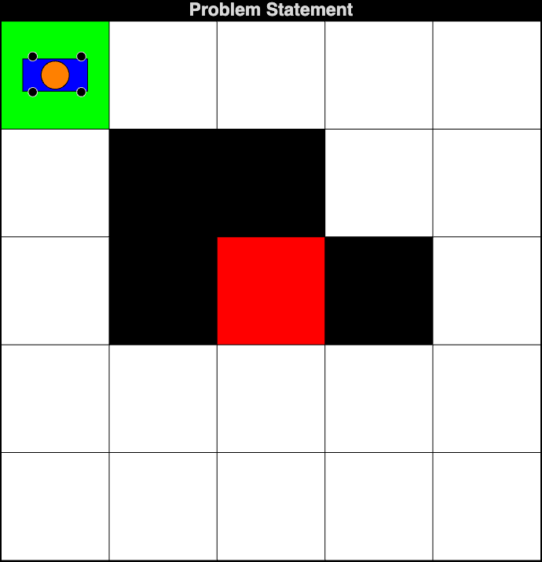
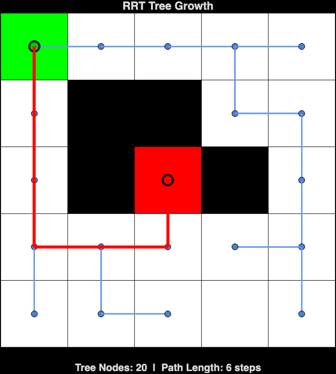
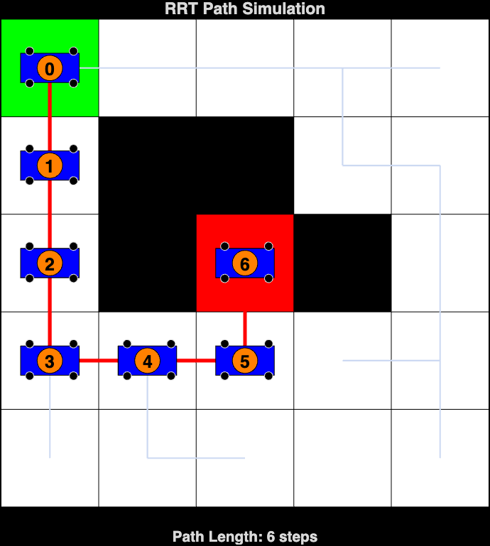

# RRT Pathfinding Algorithm Simulation

This project implements the **RRT (Rapidly-exploring Random Tree)** algorithm for pathfinding in a grid-based environment, simulating the movement of a robot from a start cell to a goal cell while avoiding obstacles. The simulation visualizes the grid, the animated tree growth, and the extracted path. Unlike deterministic algorithms (Grassfire, Dijkstra, A\*), RRT is a **probabilistic planner** — the tree structure and path may differ between runs.

## Table of Contents
- [Introduction](#introduction)
- [Features](#features)
- [Requirements](#requirements)
- [Usage](#usage)
  - [Parameters](#parameters)
  - [Example](#example)
- [How RRT Works](#how-rrt-works)
- [File Structure](#file-structure)
- [Results](#results)
  - [RRT Tree Growth](#rrt-tree-growth)
  - [Path Simulation](#path-simulation)
- [License](#license)
- [Acknowledgments](#acknowledgments)
- [References](#references)

## Introduction
This project implements a robot pathfinding simulation using the RRT (Rapidly-exploring Random Tree) algorithm on a grid-based environment. RRT is a **sampling-based probabilistic planner** that builds a tree by randomly sampling the configuration space and incrementally growing toward samples. It introduces a fundamentally different approach compared to graph-search algorithms like Grassfire, Dijkstra, or A*. While RRT does not guarantee the shortest path, it is **probabilistically complete** and excels in complex, high-dimensional environments.

## Features
- **Grid Visualization**: Displays a grid with start (green), goal (red), and obstacle (black) cells.
- **Animated Tree Growth**: Visualizes the RRT tree expanding node-by-node in real time.
- **Goal Bias**: 30% probability of sampling the goal cell to accelerate convergence.
- **Path Extraction**: Backtracks through the tree from goal to start to extract the path.
- **Path Highlighting**: The final path is drawn in red over the blue tree edges.
- **Consistent Results**: RRT is run once and the same tree/path is shared across all visualizations.
- **Robot Representation**: The robot is represented as a blue rectangle with wheels and an orange top mount.
- **MATLAB Graphics**: Utilizes MATLAB's graphical capabilities to create an interactive simulation experience.

## Requirements
- MATLAB (preferably R2018b or later)

## Usage
Clone this repository and run the `start_simulation.m` file, providing the grid dimensions, start cell, goal cell, and obstacles as input parameters.

### Parameters
To run the simulation, call the `start_simulation` function with the appropriate parameters:

```matlab
start_simulation(m, n, startCell, goalCell, obstacles)
```

- `m`: Number of rows in the grid.
- `n`: Number of columns in the grid.
- `startCell`: Linear index of the start cell (row-major order).
- `goalCell`: Linear index of the goal cell (row-major order).
- `obstacles`: Array of linear indices representing obstacle cells.

### Example

```matlab
m = 5; % Number of rows
n = 5; % Number of columns
startCell = 1; % Start cell index
goalCell = 13; % Goal cell index
obstacles = [7, 8, 12, 14]; % Obstacle cells

start_simulation(m, n, startCell, goalCell, obstacles);
```

**Note**: Since RRT is probabilistic, running the simulation multiple times will produce different trees and potentially different paths. This is expected behavior and demonstrates the algorithm's randomized nature.

## How RRT Works
The RRT algorithm builds a search tree through random sampling and incremental extension:

### Algorithm Steps
1. **Initialize**: Create a tree with the start cell as the root node.
2. **Random Sampling**: Generate a random cell in the grid. With 30% probability, sample the goal cell instead (goal bias) to accelerate convergence.
3. **Nearest Neighbor**: Find the tree node closest to the random sample using Manhattan distance.
4. **Steer**: Move one step from the nearest node toward the sample (4-directional movement).
5. **Collision Check**: If the new cell is obstacle-free and not already in the tree, add it as a child node.
6. **Goal Check**: If the new cell is the goal, stop and extract the path.
7. **Repeat**: Return to Step 2 until the goal is reached or maximum iterations exceeded.

### Path Extraction
Once the goal is added to the tree, the path is extracted by backtracking through parent pointers from the goal node to the start (root) node.

### Algorithm Characteristics
| Property | Value |
|----------|-------|
| Search Strategy | Random sampling with goal bias |
| Data Structure | Tree (parent pointers) |
| Movement | 4-directional (up, down, left, right) |
| Deterministic | No (probabilistic) |
| Optimality | Not guaranteed |
| Completeness | Probabilistically complete |
| Best For | Complex or high-dimensional environments |

### Key Differences from Deterministic Algorithms
| Property | Grassfire / Dijkstra / A\* | RRT |
|----------|---------------------------|-----|
| Approach | Systematic graph search | Random sampling |
| Deterministic | Yes (same result every run) | No (different result each run) |
| Optimality | Guaranteed shortest path | Not guaranteed (finds *a* path) |
| Exploration | Structured and exhaustive | Random with goal bias |
| Scalability | Limited in high dimensions | Excels in high dimensions |

### Simulation Workflow
The simulation runs in 3 phases. The RRT algorithm is run **once**, and the results are shared across all visualizations for consistency:
1. **Problem Statement** — Grid display with start, goal, and obstacles.
2. **Tree Growth** — Animated visualization of the RRT tree expanding, with the extracted path highlighted in red.
3. **Path Simulation** — Animated robot moving step-by-step along the RRT-extracted path, with the full tree shown faintly in the background.

## File Structure
The project consists of the following MATLAB functions:

- **`start_simulation.m`**: The main entry point. Runs the RRT algorithm once and passes the results (tree, path, success) to the visualization functions, ensuring consistent display across all phases.

- **`display_grid.m`**: Displays the grid with the start cell (green), goal cell (red), and obstacles (black).

- **`rrt_algorithm.m`**: Implements the RRT algorithm with random sampling, nearest-neighbor search, single-step steering, 30% goal bias, and collision checking. Returns the tree structure, extracted path, and success status.

- **`extract_path.m`**: Backtracks through the RRT tree from the goal node to the start node using parent pointers. Returns the path as a sequence of [row, col] pairs.

- **`display_tree.m`**: Animates the RRT tree growth on the grid, drawing edges and nodes in real time. Highlights the final path in red and displays tree statistics (node count, path length). Receives the pre-computed tree and path as input parameters.

- **`shortest_path.m`**: Animates the robot moving step-by-step along the RRT-extracted path, with the full tree drawn faintly in the background and step numbers displayed. Receives the pre-computed tree and path as input parameters.

- **`draw_robot.m`**: Draws the robot's representation on the grid. The robot features a blue rectangular body, black wheels, and an orange circular top mount.

- **`index_to_rowcol.m`**: Converts a linear cell index to its corresponding row and column indices using **row-major order** (left-to-right, top-to-bottom).

## Results

### RRT Tree Growth


### Path Simulation


## License
This project is licensed under the MIT License. See the LICENSE file for details.

## Acknowledgments
- Inspired by algorithms for pathfinding and robotics.

## References
1. **RRT Algorithm**:
   - S. M. LaValle, "Rapidly-exploring random trees: A new tool for path planning," Technical Report TR 98-11, Computer Science Dept., Iowa State University, 1998.
   - S. M. LaValle and J. J. Kuffner, "Randomized kinodynamic planning," *International Journal of Robotics Research*, vol. 20, no. 5, pp. 378-400, 2001.
   - [Wikipedia: Rapidly-exploring random tree](https://en.wikipedia.org/wiki/Rapidly-exploring_random_tree)

2. **Sampling-based Planning**:
   - S. M. LaValle, *Planning Algorithms*. Cambridge University Press, 2006.
   - L. E. Kavraki, P. Svestka, J.-C. Latombe, and M. H. Overmars, "Probabilistic roadmaps for path planning in high-dimensional configuration spaces," *IEEE Trans. on Robotics and Automation*, vol. 12, no. 4, pp. 566-580, 1996.

3. **RRT Variants**:
   - S. Karaman and E. Frazzoli, "Sampling-based algorithms for optimal motion planning," *International Journal of Robotics Research*, vol. 30, no. 7, pp. 846-894, 2011. (RRT\* — optimal variant)

4. **Mobile Robots**:
   - B. Siciliano et al., *Springer Handbook of Robotics*, 2nd ed. Springer, 2016.
   - R. Siegwart, I. R. Nourbakhsh, and D. Scaramuzza, *Introduction to Autonomous Mobile Robots*, 2nd ed. MIT Press, 2011.

5. **MATLAB Graphics**:
   - MATLAB Documentation: [Graphics](https://www.mathworks.com/help/matlab/graphics.html)
